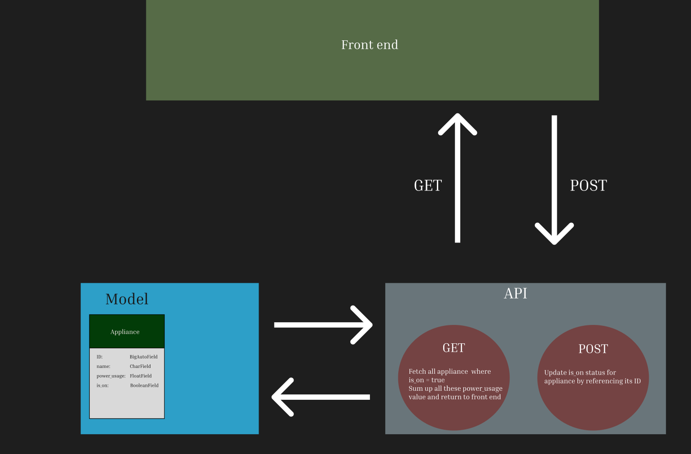

# HACC Backend

## Overview
This backend simulates household energy usage on a display using numbers, bar graphs, or line charts. When an appliance is turned on, the display increases by a typical energy value, helping users understand home energy consumption. These values are based on common appliance data, making the simulation educational and easy to relate to.


## Requirement
In the physical playhouse, kids will use toggle switches to trigger values for display. For the code challenge, only the output display and visualization are needed, not the full Arduino input system. However, an Arduino-compatible way to feed signals to the display would be beneficial.

## Run Backend Locally
Clone down repo.

```
git clone https://github.com/PhatCa/hacc-comp-sience-backend.git
```

Create virtual env.

```
python -m venv venv
or 
python3 -m venv venv
```

Activate virtual env.
Example:

```text
source venv/bin/activate
```

Install Python requirements.

```text
pip install -r requirements.txt
or
pip3 install -r requirements.txt
```

Run Django server

```text
python manage.py runserver
or
python3 manage.py runserver
```

You may need to run `python manage.py migrate or python3 manage.py migrate`
To set up user, run `python manage.py createsuperuser`

## Design

### Visual



1. Data Models: 

* ID: BigAutoField
* name: CharField
* power_usage: FloatField
* is_on: BooleanField(default=False)

2. API Design:

* GET:
Fetch all appliance  where is_on = true
Sum up all these power_usage value and return to front end

* POST:
Update is_on status for appliance by referencing its ID


## Optional
"The program we are looking for in the code challenge is just the display
part, not the full input Arduino system. Just the output display and
visualization. But we would appreciate it if we had an arduino-friendly way
of feeding the display the signals." - [Special Requirements](https://hacc.hawaii.gov/wp-content/uploads/2024/10/HKM-Energy-Usage-Challenge_2024.pdf)

### Basic Approach to get data for front end
Front end using polling to send a GET request to get update and set timer to be every 5 second

### WebSockets(Real-Time Approach)
Set up Channel and Web Socket to get real-time update

## Additional document for backend for Channel and Websocket

1. [Introduction to Django Channels and WebSocket - 2023](https://medium.com/@adabur/introduction-to-django-channels-and-websockets-cb38cd015e29)

2. [Building Dynamic Real-Time Apps with Django Channels - 2023](https://medium.com/@joloiuy/building-dynamic-real-time-apps-with-django-channels-8373fc173a1b)


## Local Testing (important)

Create a local_settings.py file and needed to be in api folder (same directory with settings.py) to create a sqlite3 local database instead using production database

```django
from pathlib import Path
DATABASES = {
    'default': {
        'ENGINE': 'django.db.backends.sqlite3',
        'NAME': BASE_DIR / 'db.sqlite3',
    }
}
DEBUG=True
```